# Readme for Lab 10

## Difference in solutions

#### AspectJ Solution
> - AspectJ solution provides a one class and mainatable solution.
> - Provides config file to alter the machine for different configurations.
> - More precise and easier to debug and maintain when used with AspectJ.

#### Lab-1 Solution
> - Uses inheritance to achieve variability in machines.
> - Maintainable but not as good as Aspect oriented solution.
> - Might cause problems when there are structural changes to an actual Gumball Machine.

## Gumball Machine V1
> - V1 machine has configurations for different costs like `25` and `50`.
>> - Accepts either `Quarters` or `Any Coin ` in  `5,10,25 and 50`.

#### Config-1
<b>For cost 25 and quarter machine</b>  
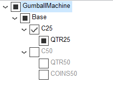</img>

#### Output
<b>For cost 25 and quarter machine</b>  
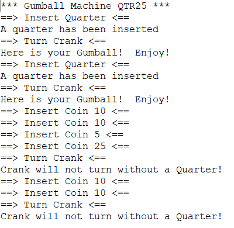</img>

#### Config-2
<b>For cost 50 and quarter machine</b>  
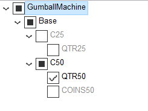</img>

#### Output
<b>For cost 50 and quarter machine</b>  
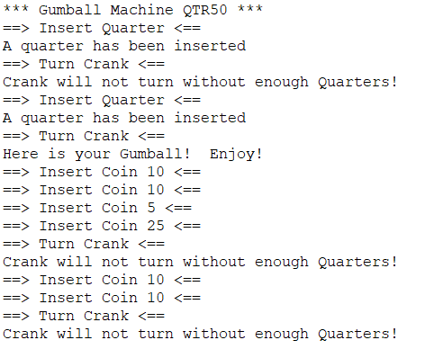</img>

#### Config-3
<b>For cost 50 and any coin machine</b>  
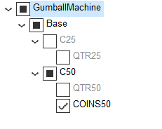</img>

#### Output
<b>For cost 50 and any coin machine</b>  
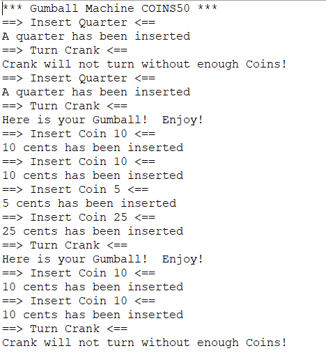</img>

## Gumball Machine V2
> - Consists of slot based and crank based machines.
>> - Provides configurations for `crank based quarter machines` and `crank based two quarter machines` .
>> - Provides configuration for slot models with gumball cost as `25 cents` or `50 cents`.
> - 4 possible configurations.

#### Config-1
<b>For cost 25 and crank based one quarter machine</b>  
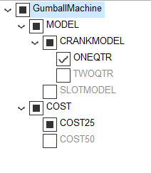</img>

#### Output
<b>For cost 50 and crank based two quarter machine</b>  
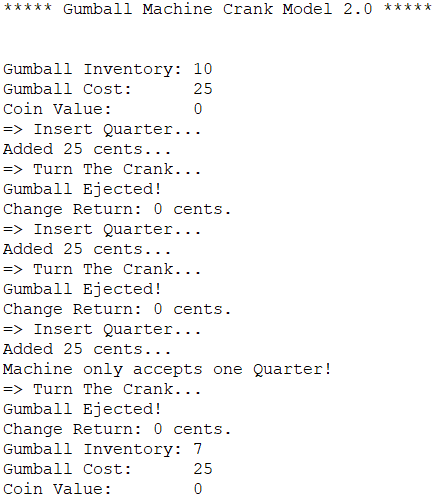</img>

#### Config-2
<b>For cost 25 and crank based one quarter machine</b>  
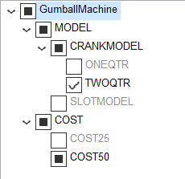</img>

#### Output
<b>For cost 50 and any coin machine</b>  
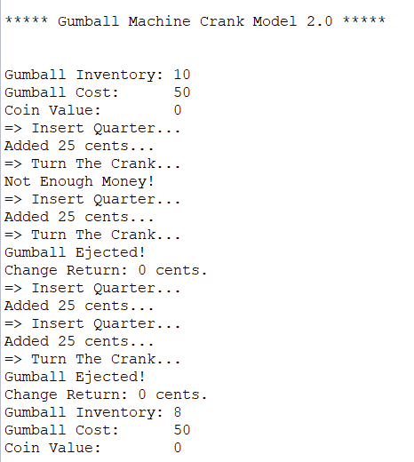</img>

#### Config-3
<b>For cost 25 and slot based machine</b>  
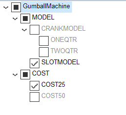</img>

#### Output
<b>For cost 50 and any coin machine</b>  
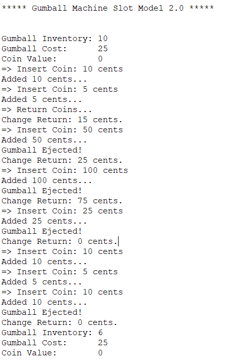</img>

#### Config-4
<b>For cost 50 and slot based machine</b>  
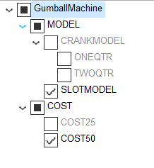</img>

#### Output
<b>For cost 50 and any coin machine</b>  
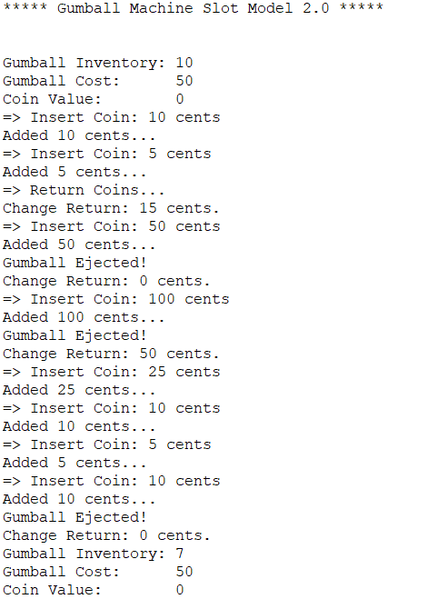</img>
